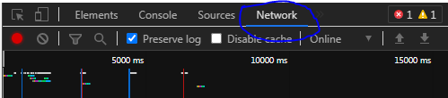
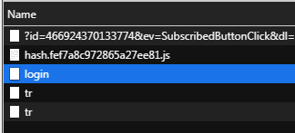

# Requirement
- Python 3.7.x

Download python di https://www.python.org/downloads/
# Setup
Install modul `requests` dan `colorama` dengan perintah berikut
```sh
pip install requests colorama
```
# Login
proses login tidak menggunakan password, melainkan menggunakan hash.

1. pertama buka chrome incognito lalu buka web https://shopee.co.id/buyer/login .
2. tekan F12, lalu masuk tab network
3. 


3. masukkan username dan password lalu klik `Login`.
6. cari item bertuliskan `login`
7. 


7. lalu scroll sampai bawah dan klik kanan pada item `password`
8. 

10. 
11. pilih copy value.
12. buka cmd/terminal
13. jalankan `login.py` dengan perintah berikut
```
python login.py
```
14. masukkan username/email/no hp
15. masukkan hash yang sudah disalin tadi
16. selesaikan proses verifikasi

sudah login/siap digunakan.

Note: perlu login ulang setelah beberapa hari

jalankan scriptnya dengan perintah berikut
```
python main.py
```
# Tambahan
untuk speed tergantung koneksi internet masing masing.
dan tidak menjamin 100% dapat
